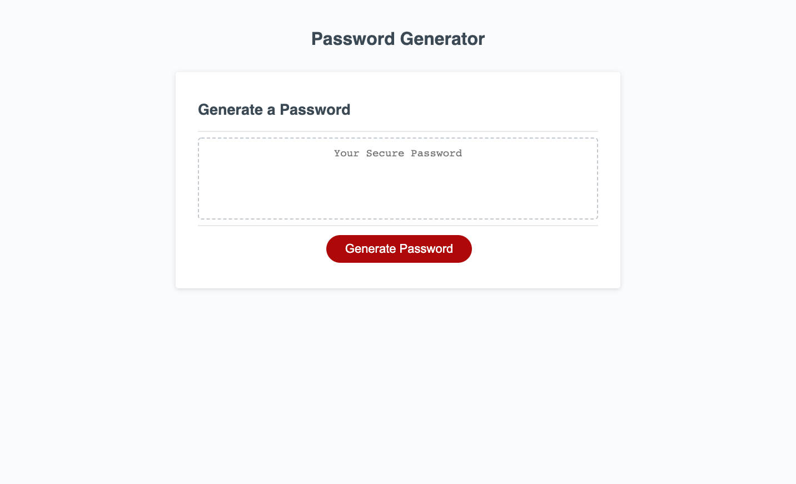

# Password Generator

# DESCRIPTION

This project is a password generator that allows the user to choose the lenght of the password and which characters will be used to create the password. The password generator then uses the inputs to generate the password based on the user's selected criteria.

## VISUALS

## POINTS OF INTEREST

* Press some buttons... 
    * Get a password!
    
[Voila!](https://media.giphy.com/media/Ws4gfyK51QwQTYpNCO/giphy.gif) 

## CONTRIBUTORS

 

Also, shout out to my tutors for the assistance. They are the real MVPs! 

## DEPLOYED APPLICATION

https://ssbbgm.github.io/password-generator/
